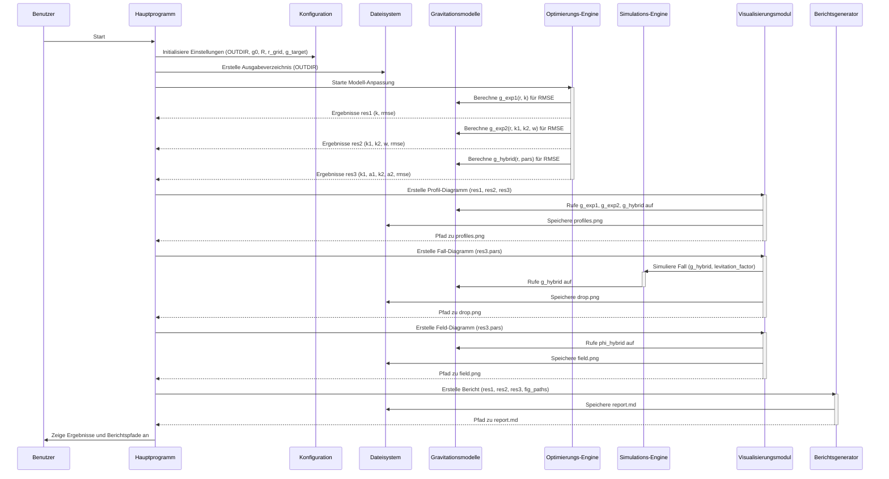

```mermaid
sequenceDiagram
    participant User as Benutzer

    participant Main as Hauptprogramm
    participant Config as Konfiguration
    participant FileSystem as Dateisystem

    participant Models as Gravitationsmodelle
    participant OptimizationEngine as Optimierungs-Engine

    participant SimulationEngine as Simulations-Engine
    participant VisualizationModule as Visualisierungsmodul

    participant ReportGenerator as Berichtsgenerator

    User->>Main: Start
    Main->>Config: Initialisiere Einstellungen (OUTDIR, g0, R, r_grid, g_target)
    Main->>FileSystem: Erstelle Ausgabeverzeichnis (OUTDIR)

    Main->>OptimizationEngine: Starte Modell-Anpassung
    activate OptimizationEngine
    OptimizationEngine->>Models: Berechne g_exp1(r, k) für RMSE
    OptimizationEngine-->>Main: Ergebnisse res1 (k, rmse)
    OptimizationEngine->>Models: Berechne g_exp2(r, k1, k2, w) für RMSE
    OptimizationEngine-->>Main: Ergebnisse res2 (k1, k2, w, rmse)
    OptimizationEngine->>Models: Berechne g_hybrid(r, pars) für RMSE
    OptimizationEngine-->>Main: Ergebnisse res3 (k1, a1, k2, a2, rmse)
    deactivate OptimizationEngine

    Main->>VisualizationModule: Erstelle Profil-Diagramm (res1, res2, res3)
    activate VisualizationModule
    VisualizationModule->>Models: Rufe g_exp1, g_exp2, g_hybrid auf
    VisualizationModule->>FileSystem: Speichere profiles.png
    VisualizationModule-->>Main: Pfad zu profiles.png
    deactivate VisualizationModule

    Main->>VisualizationModule: Erstelle Fall-Diagramm (res3.pars)
    activate VisualizationModule
    VisualizationModule->>SimulationEngine: Simuliere Fall (g_hybrid, levitation_factor)
    activate SimulationEngine
    SimulationEngine->>Models: Rufe g_hybrid auf
    deactivate SimulationEngine
    VisualizationModule->>FileSystem: Speichere drop.png
    VisualizationModule-->>Main: Pfad zu drop.png
    deactivate VisualizationModule

    Main->>VisualizationModule: Erstelle Feld-Diagramm (res3.pars)
    activate VisualizationModule
    VisualizationModule->>Models: Rufe phi_hybrid auf
    VisualizationModule->>FileSystem: Speichere field.png
    VisualizationModule-->>Main: Pfad zu field.png
    deactivate VisualizationModule

    Main->>ReportGenerator: Erstelle Bericht (res1, res2, res3, fig_paths)
    activate ReportGenerator
    ReportGenerator->>FileSystem: Speichere report.md
    ReportGenerator-->>Main: Pfad zu report.md
    deactivate ReportGenerator

    Main->>User: Zeige Ergebnisse und Berichtspfade an
```